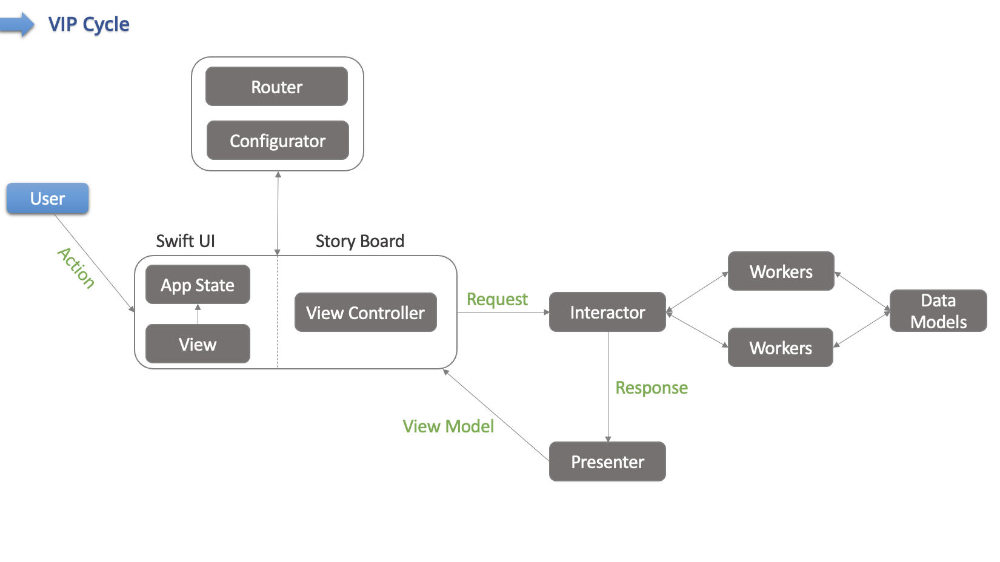

#  Scenes

* Every scene corresponds to one or more page which related to each other
* Scenes use VIP Architecture
* Scene managed by View (View Controller), Interactor and Presenter
* Routing logic is seperated to different file. Every scene has its own router.
* To make this architecture setup easier we have configurator class. This classes setup relation of classes in scene

## VIP cycle

We are using the Clean Swift approach for separating concerns for the different screens. Every scene* has it's own VIP cycle which manages:
[For more information](https://hackernoon.com/introducing-clean-swift-architecture-vip-770a639ad7bf)

* loading the data from the DB or backend - Interactor
* preparing the data in a form ready to be displayed in the view controller - Presenter
* triggering actions on user events - ViewController(s)/View(s)
* routing to a new scene - Router

### ViewControllers/Views
* Should not contain any logic - just interactor and router calls

### Interactors
* All processing should be done on the background thread 
* Holds business logic
* Loading the data from the DB or backend - Interactor

### Presenters
* Preparing the data in a form ready to be displayed in the view controller - Presenter
* Should do any processing on the background thread as well, when possible.
* Make sure to dispatch back to the main thread when calling the view controller.
* Should contain a `weak` reference to the viewController - otherwise there will be a retain cycle in the VIP.

### Routers
* Contain the logic to move through the application flow
* Set the necessary configuration for the next scene to be displayed

### Scene Related Models 

#### Request
* Parameters that need to be sent to the API request.
* For Interactor interface functions
* Contains all function parameters in one object. 
* Generally ViewController/Views creates it to call interactor

#### Response 
* Intercepts the response from the API and stores the appropriate data.
* For Presenter interface functions
* Contains all function parameters in one object.
* Interactor creates it to call presenter

#### ViewModel
* Everything that you need to show to the UI is stored here. For example, your API returns objects with 10 parameters, but you only need to show 4 of them.
* For ViewController interface functions
* Contains view related information
* Presenter creates it to call ViewController

